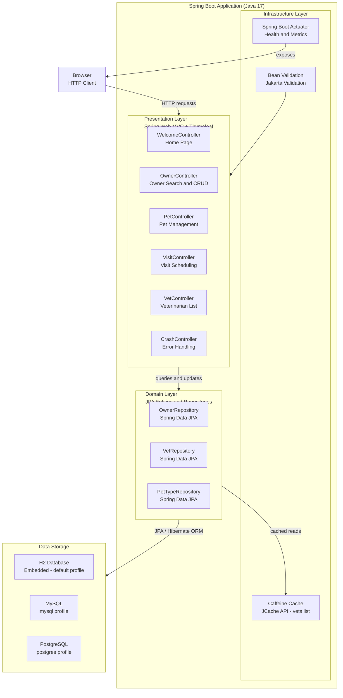

# Architecture Diagram

Spring PetClinic is a layered Spring Boot web application managing pet clinic operations including owners, pets, veterinarians, and visit scheduling.

## Application Architecture

